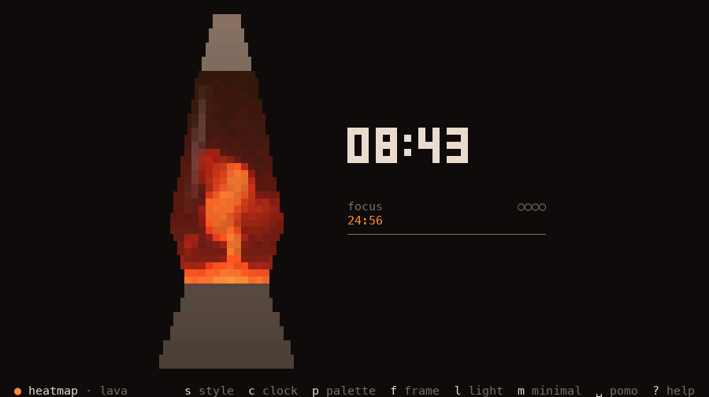
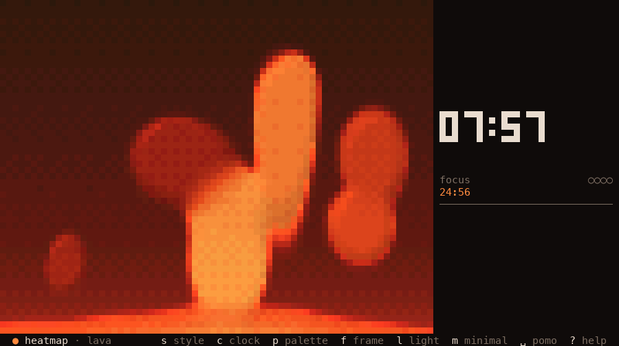

# lavatui

A lava lamp for your terminal. Blobs of wax warm on the heater, rise,
cool, sink, merge and split, and you can draw them in twelve render
styles: smooth half-blocks, thermal camera, braille, halftone, CRT,
digital rain and more. Next to the lamp sit a clock and a pomodoro timer.
Turn those off with one key and you just have the lamp.


Built with Rust and [ratatui](https://ratatui.rs). It's one small binary
with no runtime dependencies and no Nerd Fonts.

## Gallery

**Twelve render styles.** These are all the same seed and the same moment,
in minimal mode with lighting on:


**Eight palettes** (shown in the heatmap style):


| Glass frame | Bleed frame (`f`) |
|---|---|
|  |  |
| **Minimal mode** (`m`): just the lamp | **Help** (`?`): the lamp keeps going behind it |
|  |  |
| **Style picker** (`S`) with live preview | **16 colours** (`--color 16`) |
|  |  |

| Portrait terminal (36×56): panel moves below | Tiny terminal (26×10): lamp + clock chip |
|---|---|
|  |  |

## Features

- **The wax is simulated.** Heat comes from the base. Warm wax gets
  buoyant and rises, cools at the top and sinks back, and it merges, necks
  and splits on the way. The wax area is conserved, and every run is
  deterministic for a given `--seed`.
- **12 render styles** that you can cycle with `s` or pick with `S`
  (live preview): solid, outline, heatmap, ascii, dither, braille,
  halftone, crt, synthwave, matrix, topo, chrome.
- **8 palettes**: lava, ultraviolet, abyss, toxic, synthwave, mono, paper
  (light) and ansi (your terminal's own colours).
- **Optional lighting** (`l`): dome shading with a key light, a glow
  around hot wax, warm light from the base and a highlight on the glass.
- **Glass or bleed.** The lamp is drawn as a lava-lamp silhouette, or the
  wax fills the whole window. `auto` chooses by window shape.
- **Clock faces**: blocks, segment, analog, binary, words and text. Each
  face comes in several sizes, and the largest one that fits is used; on
  a very large terminal the panel widens for the biggest ones.
- **Pomodoro timer** (`space`) with focus and break phases, cycle dots,
  a phase-change flash and an optional bell.
- **It looks right at any size.** It works from 1×1 to a 4K full-screen
  terminal. When space runs out, panels collapse into a chip and margins
  shrink, and nothing is ever truncated or overlapping.
- **Colour fallbacks are automatic**: truecolor → 256 (perceptual,
  hue-preserving match) → 16 → `NO_COLOR`. Every style still reads in 16
  colours and in monochrome.
- **Minimal mode** (`m` / `-m`) shows just the lamp, with a tiny clock
  under it.
- **It's light on resources.** About 2 % of a core at 80×24 and about 5 %
  at 200×60, at 60 fps. It drops to 10 fps when the terminal loses focus
  and sleeps while frozen. See [Performance](#performance).

## Install

You need a Rust toolchain with edition 2024 support (Rust 1.85 or newer).

```sh
git clone <this repo> lavatui && cd lavatui
cargo install --path .
lavatui
```

Or run it in place with `cargo run --release`. The simulation wants a
release build.

**Terminal:** a truecolor terminal looks best (iTerm2, kitty, WezTerm,
Alacritty, Ghostty, Windows Terminal, recent GNOME Terminal and others).
The colour depth is detected from `NO_COLOR`, `COLORTERM` and `TERM`, and
the app falls back on its own, or you can force a depth with `--color`.
Any font with Unicode block elements and braille works, so no Nerd Font
is needed. On macOS, Terminal.app has no truecolor and gets the 256-colour
path.

## Usage

```
lavatui [OPTIONS]

  -m, --minimal         Just the lamp: no panels, status bar or hints
      --fps <N>         Target render frames per second (the simulation rate is fixed separately)
      --style <NAME>    Render style for this session (e.g. solid, outline, heatmap, ascii, chrome)
      --palette <NAME>  Palette for this session (lava, ultraviolet, abyss, toxic, synthwave, mono, paper, ansi)
      --color <DEPTH>   Colour depth, instead of detecting it from the environment [auto, truecolor, 256, 16, none]
      --seed <U64>      Seed the wax simulation: the same seed always plays out the same lamp (default: a new seed every launch)
      --config <PATH>   Read and write settings here instead of the XDG config dir
  -h, --help            Print help
  -V, --version         Print version
```

Flags apply to the current session only and are never written back to
the config file. A setting you change in the app is saved as usual. An
unknown `--style` or `--palette` name exits with the list of valid ones.

### Keys

| Key | Action |
|---|---|
| **Lamp** | |
| `s` / `S` | next style / style picker |
| `p` / `P` | next palette / palette picker |
| `f` | frame: auto → glass → bleed |
| `l` | lighting on/off |
| `[` / `]` | heat − / + (5 steps) |
| `-` / `+` (`=`) | sim speed ×0.25 … ×4 |
| `z` | freeze / unfreeze the lamp |
| `0` | reset heat and speed |
| `R` | reseed the wax |
| **Clock & pomodoro** | |
| `c` / `C` | next clock face / face picker |
| `t` | show/hide the clock |
| `T` | 12h / 24h |
| `space` | pomodoro start / pause / resume |
| `n` | skip to the next phase |
| `r` `r` | reset the pomodoro (press twice within 2 s) |
| **App** | |
| `m` | minimal mode on/off |
| `b` | status bar on/off |
| `d` | debug HUD (fps, frame time, samples) |
| `ctrl-l` | force a full redraw |
| `?` | help |
| `q` / `ctrl-c` | quit |

`esc` never quits: it only closes overlays. When help or a picker is
open, `q` closes it instead of quitting.

- **In help:** `j`/`k` or `↑`/`↓` scroll. `?`, `esc` or `q` close it.
- **In pickers:** `j`/`k` or `↑`/`↓` move (with live preview), `1`–`9`
  jump, `enter` or `space` keep, and `esc` or `q` revert. Pressing the
  opening key again keeps the choice and closes the picker. In the tiny
  inline picker, `h`/`l` and `←`/`→` move too.
- **Mouse** (opt-in, `input.mouse = true`): click or drag on the lamp to
  heat the wax there, scroll and click in pickers and help, and
  double-click to keep. It's off by default because mouse capture breaks
  the terminal's text selection.

This table matches the single `KEYMAP` table in `src/ui/keymap.rs`. That
table also drives the in-app help, so the help can't drift from the
actual bindings.

## Configuration

Settings are saved on their own, 1 s after a change and on quit, to:

- `$XDG_CONFIG_HOME/lavatui/config.toml` if `XDG_CONFIG_HOME` is set, else
- `~/.config/lavatui/config.toml` on Linux, or
- `~/Library/Application Support/lavatui/config.toml` on macOS,

or to the file given with `--config`. Every key is optional. Here are the
defaults:

```toml
[display]
fps = 60                 # 1..=240
color = "auto"           # auto | truecolor | 256 | 16 | none
cell_aspect = 2.0        # cell height / width; used only when the terminal doesn't report pixels

[lamp]
style = "solid"          # see Render styles
frame = "auto"           # auto | glass | bleed
lighting = false
heat = 3                 # 1..=5
speed = 1.0              # 0.25 | 0.5 | 1 | 2 | 4

[theme]
palette = "lava"         # see Palettes
transparent = false      # true = never paint the background (keeps terminal transparency)

[clock]
face = "blocks"          # blocks | segment | analog | binary | words | text
show = true
hour24 = true

[pomodoro]
focus_min = 25
short_break_min = 5
long_break_min = 15
cycles = 4               # focus phases before a long break
bell = true

[ui]
mode = "full"            # full | minimal
status_bar = true

[minimal]
clock = "under"          # under | corner | off

[input]
mouse = false
```

The file is meant to be edited by hand. A bad value (or a style, palette
or face that doesn't exist) is ignored, a toast names it, and the rest of
the file still applies. Keys lavatui doesn't know are reported but kept.
If a save would drop anything, the file is first copied to
`config.toml.bak`. Saves keep your
comments and write through symlinks, so a dotfile manager's link stays
intact.

## Render styles

| Style | What it looks like |
|---|---|
| `solid` | Smooth wax in half blocks, coloured by temperature, with anti-aliased edges. The default. |
| `outline` | Just the wax surface, as a thin braille contour coloured by temperature. |
| `heatmap` | A thermal camera: wax *and* liquid coloured by temperature, so you can see the warm base and the cooling plumes. |
| `ascii` | A classic ` .:-=+*#%@` density ramp. It gets denser toward the core and with heat. |
| `dither` | Ordered 8×8 Bayer dithering over four flat inks. It looks the same in every colour depth. |
| `braille` | Filled wax at 2×4 dots per cell, with an engraving-like stipple that thins toward the skin. |
| `halftone` | Newsprint: a 45° screen of round dots that swell toward the hot core. |
| `crt` | A phosphor monitor: scanlines, bloom, vignette and a slow rolling hum bar. |
| `synthwave` | A 1986 sunset: striped retro-sun blobs over a neon perspective grid. |
| `matrix` | Digital rain that only shows where it crosses the wax. |
| `topo` | A topographic map of the wax field, with contour lines and elevation tints. |
| `chrome` | Glossy blown glass: domes with a body shade, a specular glint and a fresnel rim. (`glass` still works as an old name.) |

## Palettes

| Palette | Mood |
|---|---|
| `lava` | The 1970s original: red-orange wax in amber oil. The default. |
| `ultraviolet` | A blacklight poster: violet to hot pink in deep indigo. |
| `abyss` | Deep sea: teal wax glowing to seafoam in navy water. |
| `toxic` | Radioactive slime: moss to acid yellow-green. |
| `synthwave` | A 1986 sunset: hot pink → coral → gold, with a cyan accent. |
| `mono` | Graphite grayscale. It suits dither, halftone and braille. |
| `paper` | The light theme: rust-red ink on cream, for light terminals. |
| `ansi` | Uses your terminal's own 16-colour theme and default background. |

## Performance

These numbers were measured on main (`633113d`) on an Apple M5 laptop
under background load (load average 5–8), so treat them as rough.

| Measurement | Result |
|---|---|
| Launch → first frame → exit (`--frames 1`, 80×24) | ~25 ms (min 22 ms). The sim starts pre-warmed. |
| CPU at 80×24, 60 fps, glass, solid | ~2 % of one core (lighting on or off) |
| CPU at 200×60, 60 fps, glass, solid / braille | ~4–6 % of one core |
| Output at 80×24 / 200×60 (real run, glass) | ~5–10 KB/s / ~20–65 KB/s |

Here is the render time per frame at 200×60 in truecolor. This is the
field sampling plus the style draw and lighting, as measured by
`bench_lamp` (full-area bleed lamp, two sim steps per frame):

| Style | Unlit | Lit | | Style | Unlit | Lit |
|---|---|---|---|---|---|---|
| solid | 0.34 ms | 0.43 ms | | halftone | 0.13 ms | 0.16 ms |
| outline | 0.32 ms | 0.40 ms | | crt | 0.38 ms | 0.43 ms |
| heatmap | 0.44 ms | 0.51 ms | | synthwave | 0.48 ms | 0.53 ms |
| ascii | 0.14 ms | 0.18 ms | | matrix | 0.11 ms | 0.13 ms |
| dither | 0.27 ms | 0.33 ms | | topo | 0.56 ms | 0.67 ms |
| braille | 0.34 ms | 0.42 ms | | chrome | 0.44 ms | 0.50 ms |

Every style stays under 0.7 ms at 200×60. The design target is 8 ms. At
80×24, every style takes 0.02–0.13 ms. If frames ever get slow, adaptive
quality first lowers the sample grid and then drops to 30 fps. It
recovers on its own and never changes your settings.

To reproduce:

```sh
cargo test --release -- --ignored --nocapture bench_lamp    # per style, lit / unlit, bytes per frame
cargo test --release -- --ignored --nocapture bench_fill    # field sampler + sim step
cargo test --release -- --ignored --nocapture bench_light   # lighting pass alone
```

## Development

```sh
cargo test                                   # unit, render-snapshot and layout-sweep tests
cargo fmt --check && cargo clippy --all-targets -- -D warnings
UPDATE_SNAPSHOTS=1 cargo test                # rewrite snapshots (review the diff)
cargo run --release -- --config /tmp/x.toml  # try settings without touching your config
```

- [`docs/design.md`](docs/design.md) is the layout and visual design
  contract: breakpoints, hide order, palettes, keymap and performance
  targets.
- [`CLAUDE.md`](CLAUDE.md) has the architecture overview (sim, field,
  render, light, theme, layout and app model) and step-by-step guides for
  adding a render style, a clock face or a key.

All the logic is pure and unit-tested: the simulation, layout, clock,
pomodoro and the app model. Only `ui/` and `app/mod.rs` touch the
terminal.

## License

TODO: the author hasn't chosen a license yet.
