# LavaTUI

[](https://github.com/vespillo-tech/LavaTUI/actions/workflows/ci.yml)

A lava lamp for your terminal.

Warm blobs of wax rise from the bottom, cool off at the top and sink
back down. On the way they bump, join up and break apart, just like a
real lamp. You can draw the wax in nine styles and eight colour themes.
A clock, a focus timer and the song you're playing can sit beside the
lamp or float on top of it. Or turn everything off and just watch the
wax.

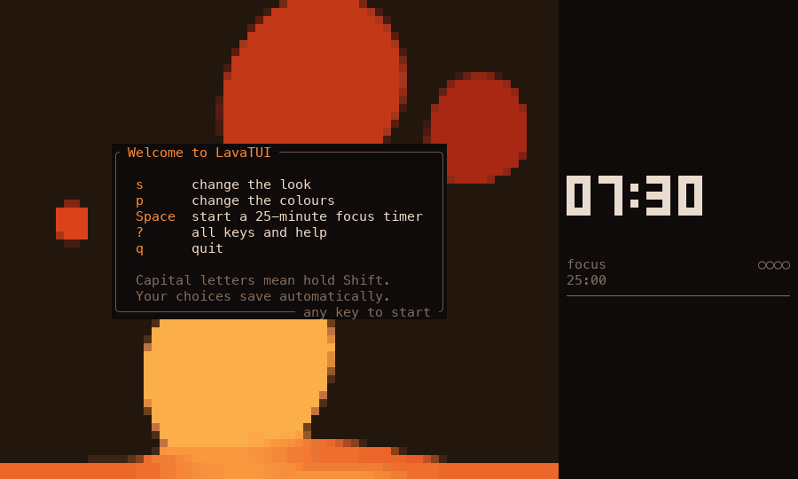

It runs in the terminal window you already use, on macOS, Linux and
Windows. It's one small program. For the best look, we recommend a
terminal that supports shaders, like [Ghostty](https://ghostty.org).
Shaders add effects such as glow, which make the wax look even better.
They do cost something, though. A shader redraws every dot of the window
on every frame, so it makes your graphics chip work harder, and more so
in a big window. Glow is one of the heaviest. If the lamp stutters or
your laptop runs warm, try a lighter shader or a smaller window (see
[Questions](#questions-and-fixes)).

We've tested LavaTUI in a handful of terminals, but not all of them. If
something looks wrong in yours, please
[open an issue](https://github.com/vespillo-tech/LavaTUI/issues) and tell
us which terminal you use. We'd love to hear how it works for you.

**Contents:**
[Pictures](#pictures) ·
[Install](#install) ·
[First run](#first-run) ·
[Keys](#keys) ·
[Settings](#settings) ·
[Music](#music) ·
[Privacy](#privacy) ·
[Terminals](#terminals) ·
[Questions](#questions-and-fixes) ·
[Platforms](#platforms) ·
[Contributing](#contributing) ·
[License](#license)

## Pictures

The lamp with the clock and a running focus timer:

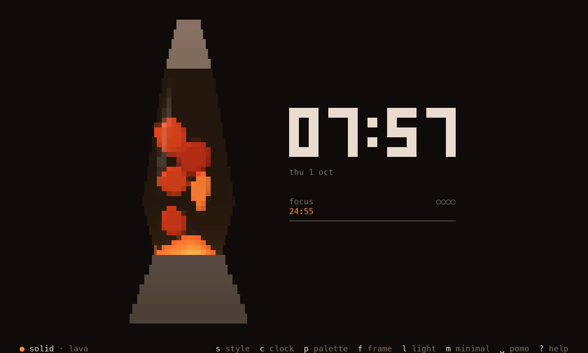

**Nine styles.** Press `s` to switch. This is the same lamp at the same
moment in each one:

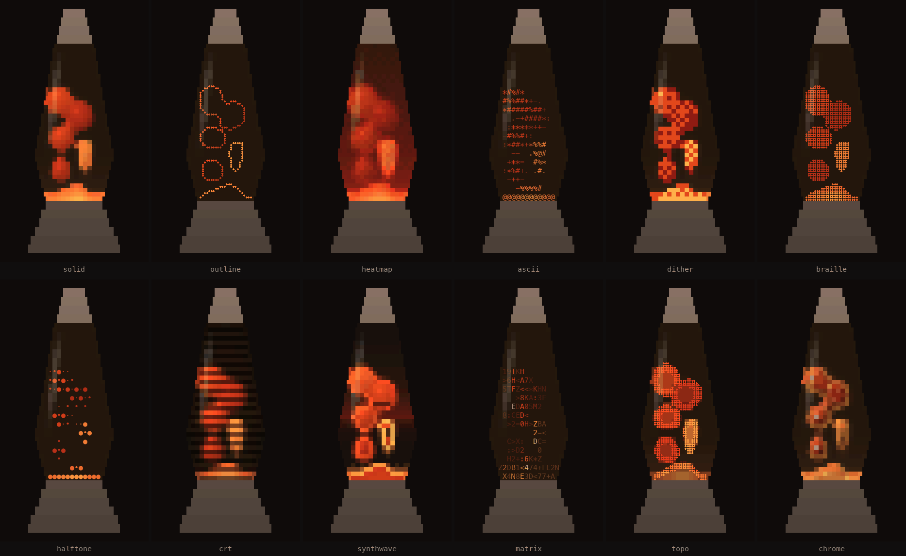

**Eight colour themes.** Press `p` to switch:

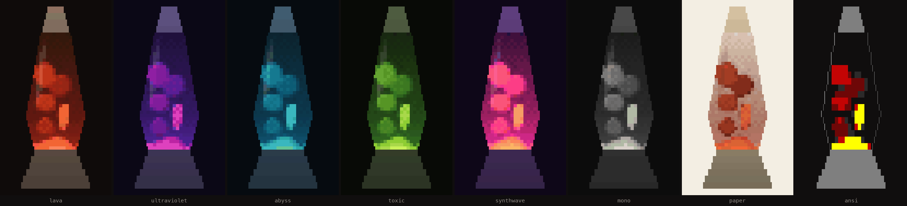

| **Music beside the lamp**, with the cover and lyrics on it | **Everything on the lamp**: music, clock and lyrics |
|---|---|
| 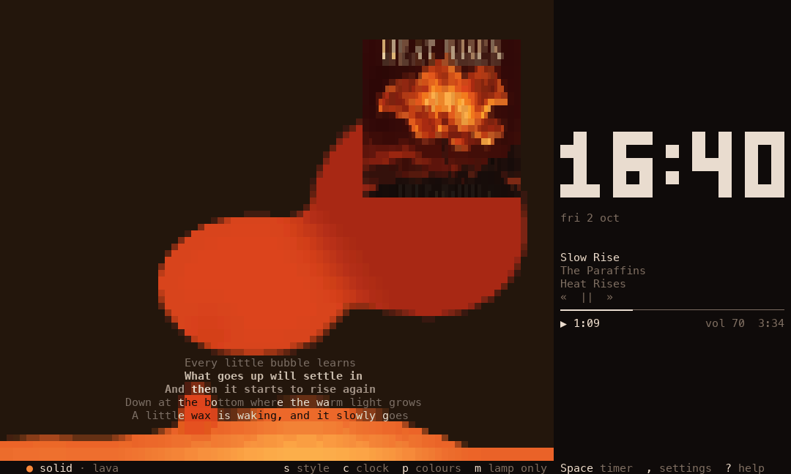 | 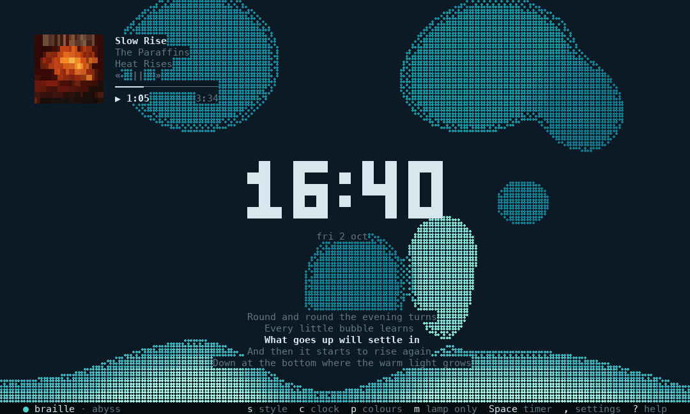 |
| **Clock and timer on the lamp** (`t`, `f`) | **Clock on the lamp, timer beside it** |
| 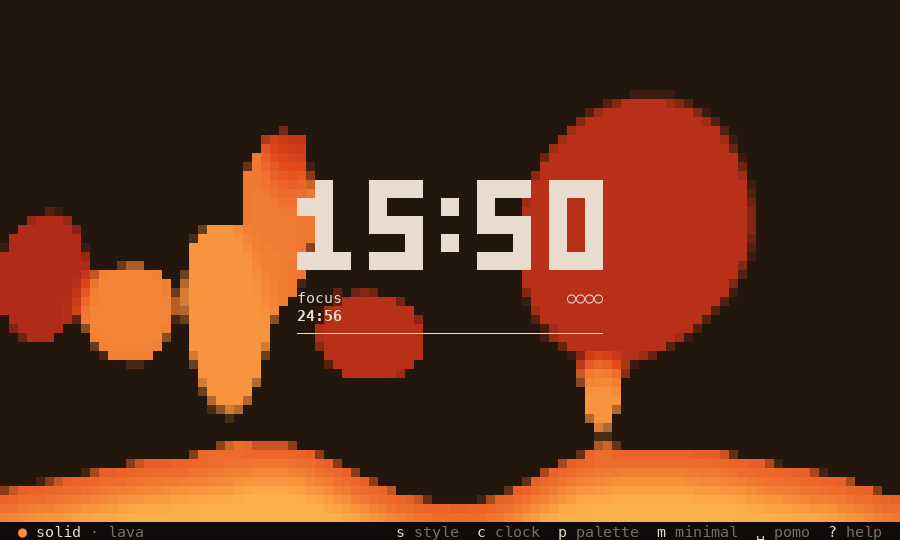 | 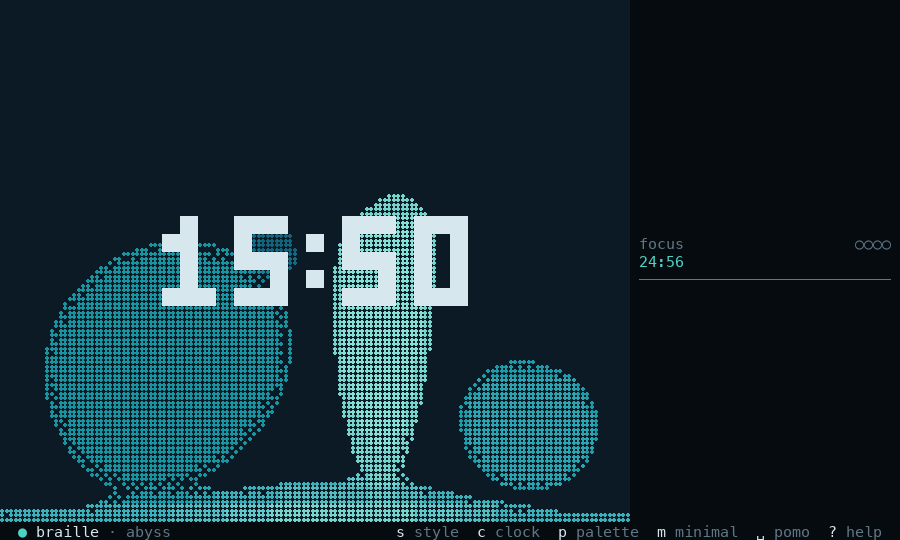 |
| **Settings** (`,`) | **Spotify setup** (inside the settings) |
| 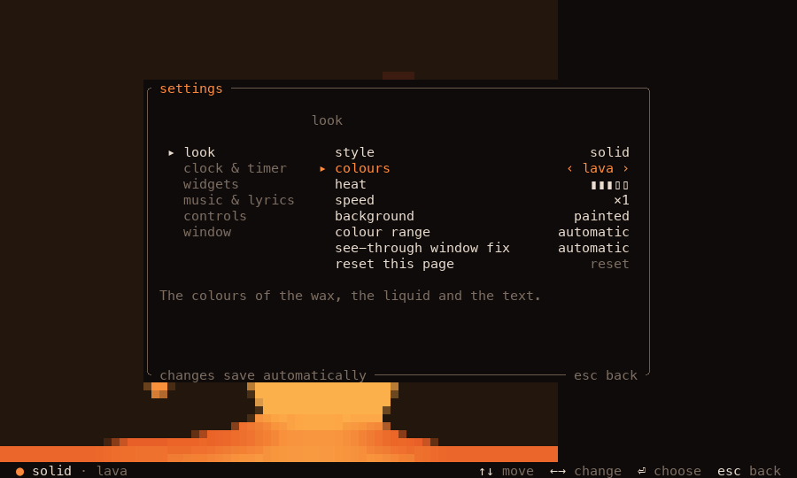 | 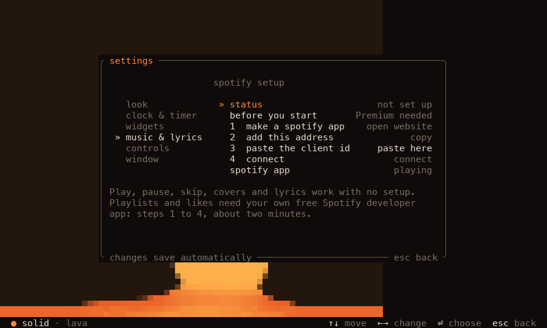 |
| **Help** (`?`): every key | **Style picker** (`Shift+S`): try before you choose |
| 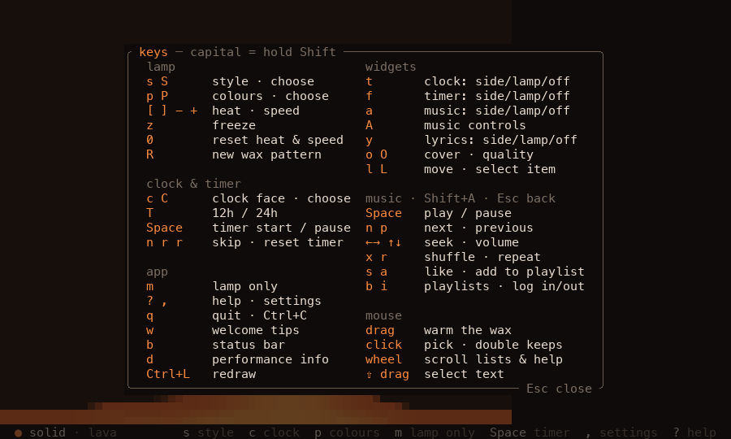 | 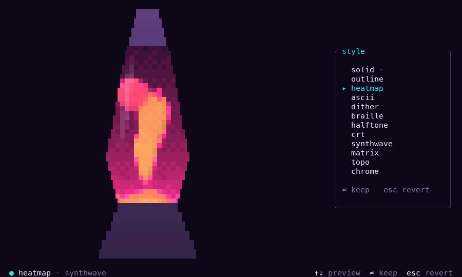 |
| **Lamp only** (`m`) | **The welcome card** on the first run |
| 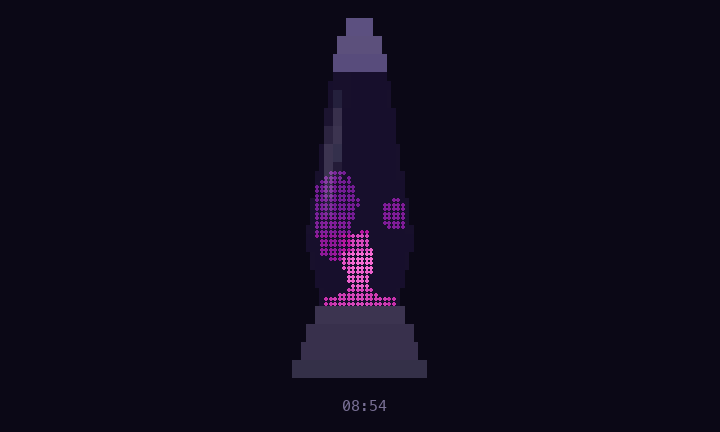 | 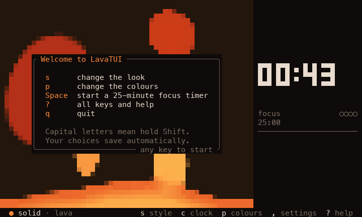 |
| **A tall, thin window**: the clock moves below | **A tiny window**: lamp and a small clock |
| 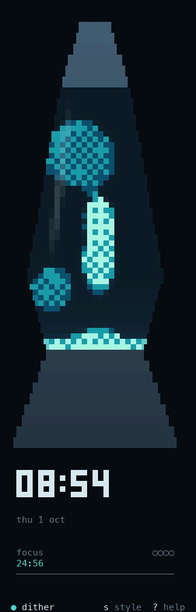 | 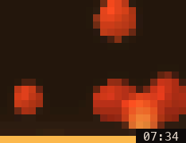 |

It also works in terminals with only 16 colours:

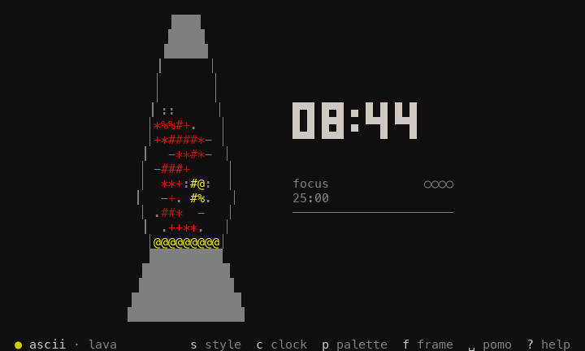

The songs, cover and lyrics in these pictures are made up for the demo.

## Install

### With Homebrew (Mac and Linux)

If you use [Homebrew](https://brew.sh):

```sh
brew install vespillo-tech/tap/lavatui
```

To update later, run `brew upgrade lavatui`.

### With one command

On a Mac or Linux, paste this into a terminal:

```sh
curl --proto '=https' --tlsv1.2 -LsSf https://github.com/vespillo-tech/LavaTUI/releases/latest/download/lavatui-installer.sh | sh
```

On Windows, paste this into PowerShell:

```powershell
powershell -ExecutionPolicy Bypass -c "irm https://github.com/vespillo-tech/LavaTUI/releases/latest/download/lavatui-installer.ps1 | iex"
```

It downloads the right program for your computer and puts it in
`~/.cargo/bin` (on Windows, `%USERPROFILE%\.cargo\bin`). Then open a new
terminal and type `lavatui`. To update, run the same command again.

### Download it yourself

1. Go to the [Releases page](https://github.com/vespillo-tech/LavaTUI/releases)
   and open the newest release.
2. Download the file for your computer:

   | Computer | File |
   |---|---|
   | Mac with Apple chip (M1 or newer) | `lavatui-aarch64-apple-darwin.tar.xz` |
   | Mac with Intel chip | `lavatui-x86_64-apple-darwin.tar.xz` |
   | Linux (64-bit PC) | `lavatui-x86_64-unknown-linux-gnu.tar.xz` |
   | Linux (64-bit ARM, like a Raspberry Pi 4 or 5) | `lavatui-aarch64-unknown-linux-gnu.tar.xz` |
   | Windows (64-bit) | `lavatui-x86_64-pc-windows-msvc.zip` |

3. Unpack it. Inside is the program, `lavatui` (or `lavatui.exe` on
   Windows).
4. Open a terminal in that folder and run `./lavatui` (on Windows:
   `.\lavatui.exe`).

To run it from anywhere, move the program to a folder on your `PATH`,
like `/usr/local/bin` or `~/.local/bin`.

On a Mac, the first try may say the program "can't be opened" or "is
damaged". That's because your browser marked it as downloaded from the
web. (Homebrew and the one-command install don't have this problem.) To
allow it, run this once in the same folder:

```sh
xattr -d com.apple.quarantine ./lavatui
```

### With Rust's `cargo`

If you have [Rust](https://rustup.rs) 1.88 or newer:

```sh
cargo install --git https://github.com/vespillo-tech/LavaTUI
lavatui
```

### From the source code

```sh
git clone https://github.com/vespillo-tech/LavaTUI
cd LavaTUI
cargo run --release
```

Use `--release`. Without it, the lamp runs much more slowly.

## First run

Start it with `lavatui`. A small welcome card shows the five keys you
need most. Press any key to put it away. Press `w` to bring it back.

- `s` changes the look, and `p` changes the colours.
- `Space` starts a 25-minute focus timer.
- Click the lamp to warm the wax where you click.
- `?` shows every key.
- `,` opens the settings.
- `q` quits.

Your choices are saved by themselves. Next time, the lamp looks the way
you left it.

You can also start it in a few ways (these don't change your saved
settings):

| Command | What it does |
|---|---|
| `lavatui -m` | just the lamp, nothing else |
| `lavatui --style braille` | start with a style |
| `lavatui --palette abyss` | start with a colour theme |
| `lavatui --seed 7` | the same wax pattern every time |
| `lavatui --fps 30` | draw 30 frames a second (less work for your computer) |
| `lavatui --help` | list every option |

## Keys

A capital letter means hold Shift: `S` is Shift+S.

**The lamp**

| Key | What it does |
|---|---|
| `s` / `S` | next style / pick a style |
| `p` / `P` | next colours / pick colours |
| `[` / `]` | less heat / more heat |
| `-` / `+` | slower / faster |
| `z` | pause the wax |
| `0` | reset heat and speed |
| `R` | a new wax pattern |

**Warm the wax with your mouse.** Click anywhere on the lamp to heat
the wax right there. Blobs near the spot warm up over about a second
and float up. Click the pool of wax at the bottom and a new blob grows
from that spot. Hold the button and drag to warm a whole path. This only
heats one spot for a moment; `[` and `]` change the heat of the whole
lamp. Your terminal has to pass mouse clicks on to programs; most do
(see [Terminals](#terminals)).

**Clock and timer**

| Key | What it does |
|---|---|
| `c` / `C` | next clock face / pick a clock face |
| `T` | 12-hour or 24-hour clock |
| `Space` | start or pause the focus timer |
| `n` | skip to the next part (focus or break) |
| `r` `r` | reset the timer (press `r` twice) |

**Where things go**

Each of these keys moves one item along: beside the lamp, then on the
lamp, then off.

| Key | Item |
|---|---|
| `t` | clock |
| `f` | focus timer |
| `a` | music (what's playing) |
| `y` | lyrics |
| `o` | album cover (`O` changes the picture quality) |
| `l` / `L` | move an item around on the lamp / pick which item `l` moves |

**The app**

| Key | What it does |
|---|---|
| `m` | lamp only, on or off |
| `?` | help |
| `,` | settings |
| `w` | the welcome card again |
| `b` | status bar on or off |
| `d` | performance info (frames per second) |
| `Ctrl+L` | redraw the screen |
| `q` or `Ctrl+C` | quit |

**Music controls**

Press `A` (Shift+A) to turn on the music controls. While they're on,
these keys control your music instead. A line at the top of the lamp
says they're on. Press `Esc` to go back.

| Key | What it does |
|---|---|
| `Space` | play or pause |
| `n` / `p` | next song / previous song |
| `←` / `→` | jump back or ahead 10 seconds |
| `↑` / `↓` | volume up or down |
| `x` / `r` | shuffle / repeat (where your player allows it) |
| `s` | like or unlike the song (Spotify setup needed) |
| `a` | add the song to a playlist (Spotify setup needed) |
| `b` | browse your playlists (Spotify setup needed) |
| `i` | log in to Spotify (press twice to log out) |

**In lists and pickers**, use the arrow keys (or `j` and `k`) to move.
`Enter` chooses. `Esc` goes back. In the playlist list, press `/` and
type to find a playlist or song. When you add a song, playlists that
already have it show a `✓`. If you pick one of those, LavaTUI asks
before adding the song again.

**The mouse** works too. Click the music buttons, or click the progress
bar to jump in the song. Click or drag on the lamp to warm the wax. Scroll
in help and lists. To select text with the mouse, hold `Shift` while you
drag (in Terminal and iTerm2 on a Mac, hold `Option`). If you'd rather
LavaTUI ignore the mouse, switch off *mouse* on the *controls* page of
LavaTUI's settings. This only changes LavaTUI, not your computer's mouse.

## Settings

Press `,` to open the settings. You'll find six pages: look, clock &
timer, widgets, music & lyrics, controls, and window. Use the arrow
keys: `↑` and `↓` pick a line, and `←` and `→` change it. You see each
change on the lamp right away. Changes save by themselves. Each page has
a "reset" line to undo your changes.

Like a real lava lamp, yours can have a thin layer of wax resting at
the top. Turn on *wax at the top* on the *look* page.

Text on the lamp (the clock, music or lyrics) picks light or dark for
each word, so it stands out from the wax behind it. Want it one colour
all the time? On the *widgets* page, set *text on the lamp* to *light*
or *dark*.

Prefer a text file? The settings live in `config.toml`:

| System | Folder |
|---|---|
| macOS | `~/Library/Application Support/lavatui/` |
| Linux | `~/.config/lavatui/` |
| Windows | `%APPDATA%\lavatui\config\` |

The [settings file guide](docs/configuration.md) lists every setting.

## Music

LavaTUI can show what you're playing: the song, the artist, the album
cover and a progress bar. Press `a` to turn it on. Press `y` for lyrics,
which light up word by word as the song plays (you can turn that off in
settings, under music & lyrics). Press `o` for a large album cover.

### Works with no setup

- **On a Mac:** the Spotify app. The first time, your Mac asks if your
  terminal may control Spotify. Say OK. (If you said no, change it in
  System Settings › Privacy & Security › Automation.)
- **On Linux:** most music players.
- **On Windows:** most apps that show up in the Windows media controls.

If more than one player is open, LavaTUI follows the one that's playing.
Spotify comes first, but only while it plays. When you pause, the keys
stay with the player you paused.

You can play, pause, skip, seek and change the volume. Some players
ignore shuffle and repeat. LavaTUI notices, tells you, and stops
offering them. You also get the
album cover and lyrics, all with no account and no setup. LavaTUI shows
whatever is already playing. It won't open your music app or start music
on its own.

The cover is a real picture in kitty, Ghostty, iTerm2, WezTerm, foot,
mlterm and Konsole. In other terminals it's drawn with text blocks.
Press `O` to change how it looks: sharp, or pixel art with small, medium
or big pixels.

### Optional: your Spotify library

With a one-time setup you can also browse your playlists, play songs from
them, like songs and add songs to playlists. Please check these rules
from Spotify first:

- **You make your own free Spotify developer app.** LavaTUI only needs
  its Client ID. That's not a password or a secret. The setup takes about
  two minutes.
- **The person who makes the developer app needs Spotify Premium.** If
  that Premium ends, the library stops working for everyone who uses
  the app.
- **At most 5 Spotify accounts can use one app, and that includes the
  owner.** The owner adds each person by email in the app's settings,
  under *User Management*.
- **Shuffle, repeat and playing a whole playlist** also need Premium on
  your own account, with Spotify playing on one of your devices. (On a
  Mac, and with Spotify on Linux, shuffle and repeat only work this way.)
- **On Windows,** LavaTUI asks Spotify which song your account is
  playing. It uses the answer only when the title and artist match, and
  the length or album too.

To start, press `,` and choose *music & lyrics*, then *spotify*. The
app walks you through each step. More detail is in
[the Spotify guide](docs/spotify.md).

## Privacy

- **Lyrics** come from [lrclib.net](https://lrclib.net), a free and open
  lyrics site. While lyrics are on, LavaTUI sends it the title, artist,
  album and length of each song you play. It sends nothing while lyrics
  are off (they start off). Answers are saved on your computer, so each
  song is looked up only once.
- **Album covers** are downloaded from your music player's image link
  and saved on your computer.
- **Where they're saved:** lyrics and covers go in your system's cache
  folder. They stay small (a few MB), and old ones are removed on their
  own. To clear saved lyrics and covers, open settings (`,`), go to
  music & lyrics, and press `Enter` twice on "saved lyrics & covers".
- **Spotify login:** your login is kept in your computer's password
  store (Keychain on a Mac, Credential Manager on Windows, the Secret
  Service on Linux). If there isn't one, or you pick *private file* in
  the Spotify setup, it's kept in a file only you can read. Logging out
  deletes it. LavaTUI talks only to Spotify for this.
- Nothing else leaves your computer. There's no tracking.

## Terminals

LavaTUI works in any modern terminal. These look best, with full colour
and real album covers:

- [Ghostty](https://ghostty.org), [kitty](https://sw.kovidgoyal.net/kitty/),
  [WezTerm](https://wezterm.org) and [iTerm2](https://iterm2.com)
- Windows Terminal, GNOME Terminal, Konsole and Alacritty (full colour;
  in some of them the cover is drawn with text)

LavaTUI checks what your terminal can do and adjusts on its own. A few
notes:

- **Terminal on a Mac:** macOS 26 and newer show full colour. Older
  versions show 256 colours, and LavaTUI switches by itself. Terminal
  leaves a thin dark line between rows of block characters. LavaTUI
  notices this and draws the lamp in a way that hides the lines.
- **Inside tmux or screen** under the Mac Terminal, LavaTUI can't tell
  it's Terminal. If you see thin lines in the wax, open the settings,
  go to *look* and set *stripe fix* to *lines between rows*.
- **See-through windows:** in Ghostty with a see-through background,
  LavaTUI draws the wax so it doesn't show stripes. It reads your
  Ghostty settings to know when.
- **Ghostex** also gets the stripe fix on its own.
- **The mouse** (clicking the wax and the music buttons) works in almost
  every terminal: Ghostty, kitty, WezTerm, iTerm2, Terminal on a Mac,
  Alacritty, GNOME Terminal, Konsole, the VS Code terminal, Ghostex and
  Windows Terminal. It doesn't work in these:
  - **tmux**, unless you turn its mouse on: add `set -g mouse on` to
    `~/.tmux.conf`.
  - **GNU screen**: clicks may not get through.
  - **Linux without a desktop**, on the plain text screen: no mouse at
    all.

  Everything the mouse does also has a key, so you lose nothing: `]`
  heats the whole lamp, and `A` turns on the music keys.

## Questions and fixes

**The colours look wrong or flat.**
Your terminal may not say how many colours it has. Try
`lavatui --color truecolor`. If that looks broken, try `--color 256`.
The settings screen can save this choice (*look* › *colour range*).

**There are thin lines between the rows of wax.**
In the settings, on the *look* page, set *stripe fix* to *lines between
rows*.

**I can't select text with the mouse.**
Hold `Shift` while you drag (`Option` in Terminal and iTerm2 on a Mac).
Or tell LavaTUI to ignore the mouse: press `,` to open LavaTUI's
settings, go to the *controls* page and switch off *mouse*. This only
affects LavaTUI. Your computer's mouse keeps working as normal.

**Clicking the lamp does nothing.**
Check that the mouse is on: press `,` to open the settings, go to the
*controls* page and switch on *mouse*. In tmux, add `set -g mouse on`
to `~/.tmux.conf`. Some terminals don't pass clicks on at all (see
[Terminals](#terminals)); there, use the keys instead.

**The music card says Spotify isn't open.**
Just open your music app and start a song, and the card will pick it up
in a moment. LavaTUI leaves it to you to open your music app, so it
never starts playing anything unexpectedly. On a Mac, if the card still
doesn't show your song, check that your terminal is allowed to control
Spotify in System Settings › Privacy & Security › Automation.

**Space doesn't start the timer.**
The music controls may be on (a line at the top says so). Press `Esc`
to leave them.

**No lyrics for a song.**
The lyrics come from lrclib.net, a free lyrics site, and it doesn't
have every song. When it has none, the lyrics box says so (for example
"no lyrics on lrclib.net for this song"). Songs without singing say
"instrumental". Lyrics also need an internet connection the first time.

**Lyrics light up too early or too late.**
Open settings (`,`), go to *music & lyrics*, and change *lyrics timing*
with the arrow keys until the words match what you hear. Bluetooth
headphones often need the lyrics a little later.

**My Mac asks for a password about the "lavatui" keychain.**
That's macOS guarding your Spotify login. LavaTUI keeps the login in
your Keychain, and macOS asks before an app reads it. Type your Mac
password and choose *Always Allow*. LavaTUI reads the login only when
you first use a Spotify library feature (like, add, playlists, shuffle)
or open the Spotify setup. It never reads it just to start, and it tells
you first.

After you update LavaTUI, macOS may ask once more. The downloads aren't
signed by Apple, so macOS treats each new version as a new app. If you'd
rather never see the question, press `,`, open *music & lyrics* ›
*spotify* and set *keep the login in* to *private file*. A file never
asks, but any program you run could read it.

**Spotify says it "refused this account".**
Your account isn't on the developer app's list, or its owner has no
Premium. See [the Spotify guide](docs/spotify.md).

**How do I make LavaTUI lighter on my computer's battery or processor?**
LavaTUI is already light: it slows down when its window isn't in front,
and it rests completely while the wax is paused (`z`). To lighten it
further, lower the frame rate with `lavatui --fps 30` (or *smoothness*
on the *window* page of the settings), or pick a simpler style such as
`braille`.

**The lamp stutters when I make my Ghostty window big.**
Check Ghostty's shaders first. A shader (glow, a screen look) redraws
every dot of the window, many times a second. In a big window that is
a lot of work for your graphics chip, so Ghostty may skip frames even
while LavaTUI keeps up. Try a smaller window, or switch off the
heaviest shader (glow is the usual one). A busy computer makes it worse.

**How do I get my settings back to normal?**
Each settings page has a reset line. Or delete `config.toml` (see
[Settings](#settings)).

## Platforms

| | macOS | Linux | Windows |
|---|---|---|---|
| The lamp, clock and timer | ✓ | ✓ | ✓ |
| Tested on a real computer | ✓ | in a test setup, with a stand-in music player | not yet |
| Music | the Spotify app | most players | most players (untested) |
| Album covers | ✓ | ✓ | ✓ (untested) |
| Volume control | ✓ | most players | – |
| Shuffle and repeat | with Spotify login and Premium | most players; Spotify with login and Premium | most players |
| Spotify library | ✓ | ✓ | ✓ (untested) |

Windows music support is new and hasn't been tried on a real Windows
computer yet. If you try it, please
[tell us how it went](https://github.com/vespillo-tech/LavaTUI/issues).
The [technical notes](docs/architecture.md#platforms) have the details.

## Contributing

Bug reports, ideas and code are all welcome. See
[CONTRIBUTING.md](CONTRIBUTING.md). How the code fits together,
performance numbers and design notes are in
[docs/architecture.md](docs/architecture.md) and
[docs/design.md](docs/design.md). What changed between versions is in
the [CHANGELOG](CHANGELOG.md).

## License

LavaTUI is free and open source. You may use it under either the
[MIT license](LICENSE-MIT) or the [Apache License 2.0](LICENSE-APACHE),
whichever you prefer.

Unless you say otherwise, anything you contribute is licensed the same
way, with no extra terms.
